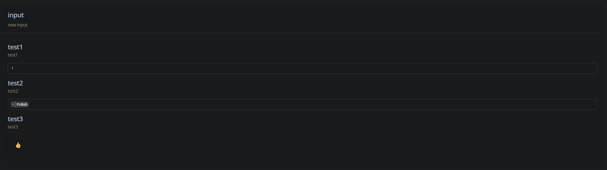

# MultiRow Formtype

A [Function](https://developer.mozilla.org/en-US/docs/Web/JavaScript/Reference/Global_Objects/Function) which returns an object for your option

## Example Usage

```js
{
    optionId: 'input',
        optionName: 'input',
        optionDescription: 'new input',
        optionType: SoftUI.formTypes.multiRow([
        {
            optionId: "test1",
            optionName: "test1",
            optionDescription: "test1",
            optionType: SoftUI.formTypes.numberPicker(1, 100, false),
            getActualSet: async ({guild,user}) => {
                // Your code here
            },
            setNew: async ({guild,user,newData}) => {
                // Your code here
            }
        },
        {
            optionId: "test2",
            optionName: "test2",
            optionDescription: "test2",
            optionType: DBD.formTypes.multiSelect({"Polish": 'pl', "English": 'en', "French": 'fr'}),
            getActualSet: async ({guild,user}) => {
                // Your code here
            },
            setNew: async ({guild,user,newData}) => {
                // Your code here
            }
        },
        {
            optionId: "test3",
            optionName: "test3",
            optionDescription: "test3",
            optionType: SoftUI.formTypes.emojiPicker(false),
            getActualSet: async ({guild,user}) => {
                // Your code here
            },
            setNew: async ({guild,user,newData}) => {
                // Your code here
            }
        }
    ])
},
```

## Image



## Params

| Name       | Type                                                                                             | Description      |
|:-----------|:-------------------------------------------------------------------------------------------------|:-----------------|
| `options`  | [Array](https://developer.mozilla.org/en-US/docs/Web/JavaScript/Reference/Global_Objects/Array) | Array of options |

## Types

-   [Array](https://developer.mozilla.org/en-US/docs/Web/JavaScript/Reference/Global_Objects/Array)
